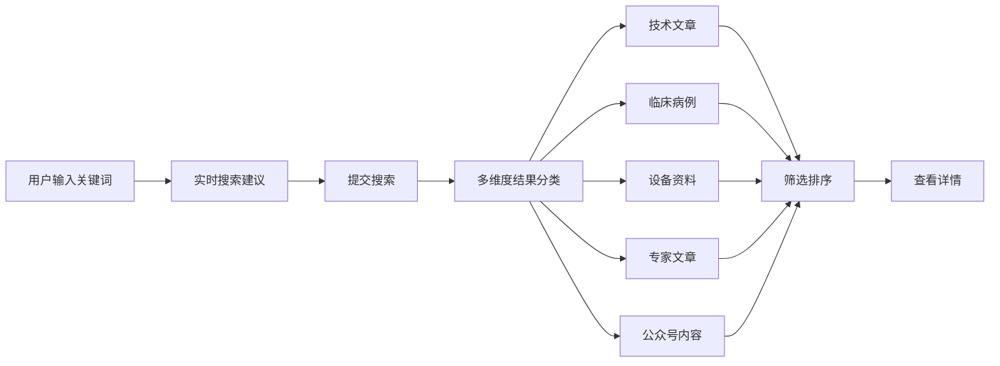
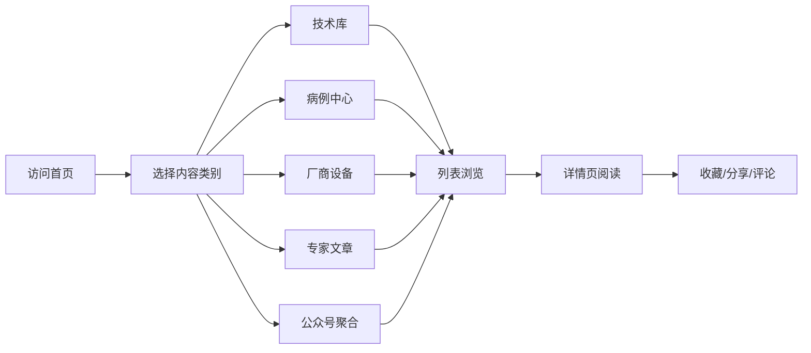

## 1. 产品概述

介入影像技术资讯与交流平台，聚焦DSA（数字减影血管造影）等介入医学影像技术，提供技术资料收集、临床病例分享、厂商设备对比、专家观点聚合等一站式服务。

- **主要目的**：构建介入医学影像领域的专业知识门户，为临床医生、技术人员、行业从业者提供权威、全面的技术资讯与学习资源
- **目标用户**：介入科医生、放射科技师、医疗器械从业者、医学生及相关研究人员
- **市场价值**：填补介入影像垂直领域专业内容平台空白，促进行业技术交流与知识传播

## 2. 核心功能

### 2.1 用户角色

| 角色 | 注册方式 | 核心权限 |
|------|----------|----------|
| 访客用户 | 无需注册 | 浏览公开内容、基础搜索 |
| 注册用户 | 邮箱/手机号注册 | 收藏文章、评论互动、订阅更新 |
| 内容贡献者 | 申请审核 | 发布病例、投稿文章、上传资料 |
| 管理员 | 后台登录 | 内容审核、用户管理、数据统计 |

### 2.2 功能模块

1. **首页**：搜索导航、精选推荐、厂商专区、最新病例、专家专栏
2. **技术库**：介入影像技术分类浏览、DSA技术详解、操作指南
3. **病例中心**：临床病例分享、分类检索、病例讨论
4. **厂商设备**：飞利浦/西门子/联影等品牌DSA产品对比、功能介绍、使用心得
5. **专家文章**：知名专家专栏、学术论文、观点评论
6. **公众号聚合**：行业公众号内容抓取、分类整理、一键订阅
7. **搜索中心**：全文检索、多维筛选、高级搜索

### 2.3 页面详情

| 页面名称 | 模块名称 | 功能描述 |
|----------|----------|----------|
| 首页 | 顶部导航 | Logo、主菜单、搜索框、登录/注册 |
| 首页 | Hero区域 | 平台标语、搜索入口、核心数据展示 |
| 首页 | 精选推荐 | 编辑推荐文章、热门病例、最新技术 |
| 首页 | 厂商专区 | 品牌卡片轮播、热门设备推荐 |
| 首页 | 最新动态 | 文章列表、病例更新、公众号快讯 |
| 首页 | 专家专栏 | 专家头像、最新文章、订阅入口 |
| 技术库页面 | 分类导航 | 技术分类树、热门标签 |
| 技术库页面 | 技术文章列表 | 卡片式布局、筛选排序 |
| 技术详情页 | 文章正文 | 富文本展示、相关推荐、收藏分享 |
| 病例中心 | 病例筛选 | 按科室/技术/难度/设备筛选 |
| 病例中心 | 病例卡片 | 缩略图、标题、作者、浏览量 |
| 病例详情页 | 病例展示 | 病史摘要、影像图片、诊疗过程、讨论区 |
| 厂商设备页 | 品牌导航 | 飞利浦/西门子/联影/GE等品牌Tab |
| 厂商设备页 | 产品对比 | 设备参数对比表、功能差异分析 |
| 厂商设备页 | 使用心得 | 用户评测、操作技巧、经验分享 |
| 专家文章页 | 专家列表 | 专家头像、简介、文章数量 |
| 专家文章页 | 文章列表 | 按专家/主题/时间筛选 |
| 公众号聚合 | 公众号列表 | 头像、名称、最新更新时间 |
| 公众号聚合 | 文章流 | 最新文章瀑布流、分类标签 |
| 搜索结果页 | 搜索栏 | 关键词输入、搜索建议 |
| 搜索结果页 | 结果分类 | 全部/技术/病例/设备/专家/公众号 |
| 搜索结果页 | 筛选排序 | 时间、相关度、热度排序 |

## 3. 核心流程

### 3.1 用户搜索流程

用户进入平台后，可通过首页搜索框或导航栏搜索入口进行全站内容检索。系统支持关键词联想、分类筛选、结果排序等功能，帮助用户快速定位所需信息。

### 3.2 内容浏览流程

## 4. 用户界面设计

### 4.1 设计风格

- **主色调**：深蓝青色系（#0D47A1 科技蓝）为主色调，传达专业、可信、科技感
- **辅助色**：医疗绿（#00C853）用于强调和交互元素，浅灰（#F5F7FA）作为背景色
- **强调色**：暖橙（#FF6D00）用于CTA按钮和重要提醒
- **按钮风格**：圆角矩形按钮，悬停时有微缩放和阴影变化
- **字体**：标题使用思源黑体（Source Han Sans），正文使用系统无衬线字体
- **布局风格**：卡片式布局，顶部固定导航，响应式栅格系统
- **图标风格**：线性图标，简洁现代，统一24px网格

### 4.2 页面设计概览

| 页面名称 | 模块名称 | UI元素 |
|----------|----------|--------|
| 首页 | Hero区域 | 渐变背景、大标题、搜索框、数据统计数字动效 |
| 首页 | 厂商专区 | 品牌Logo卡片、横向滚动、悬停放大效果 |
| 首页 | 内容卡片 | 图片+标题+摘要+标签，悬停上浮动效 |
| 技术库 | 分类侧边栏 | 可折叠树形菜单，选中高亮 |
| 病例详情 | 影像展示 | 图片轮播、放大查看、标注说明 |
| 厂商对比 | 参数表格 | 斑马纹、高亮差异项、可展开详情 |
| 搜索结果 | 结果项 | 标题高亮匹配关键词、来源标签、时间戳 |

### 4.3 响应式设计

- **桌面端优先**：1440px基准设计，12列栅格布局
- **平板适配**：768px断点，侧边栏转为顶部Tab，卡片两列布局
- **手机适配**：414px断点，导航转为汉堡菜单，单列卡片布局
- **触摸优化**：按钮最小44x44px点击区域，支持滑动手势操作

### 4.4 视觉动效

- **页面加载**：元素渐入上浮，错落延迟动画
- **卡片悬停**：轻微上浮+阴影加深+边框高亮
- **导航滚动**：顶部栏背景从透明过渡到实色
- **搜索交互**：搜索框展开/收起动画，输入时实时建议下拉
- **数据展示**：数字滚动计数动画，图表渐进式绘制
