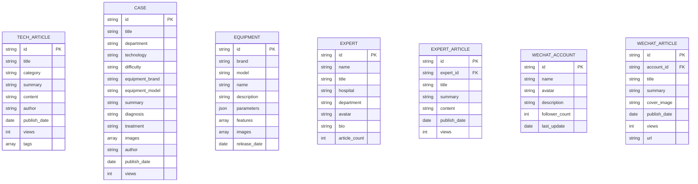

## 1. 架构设计

```mermaid
flowchart TB
    subgraph "前端展示层"
        A["React 18 单页应用"]
        A1["首页模块"]
        A2["技术库模块"]
        A3["病例中心模块"]
        A4["厂商设备模块"]
        A5["专家文章模块"]
        A6["公众号聚合模块"]
        A7["搜索中心模块"]
        A --> A1
        A --> A2
        A --> A3
        A --> A4
        A --> A5
        A --> A6
        A --> A7
    end

    subgraph "数据层"
        B["Mock 数据服务"]
        B1["技术文章数据"]
        B2["病例数据"]
        B3["厂商设备数据"]
        B4["专家文章数据"]
        B5["公众号数据"]
        B --> B1
        B --> B2
        B --> B3
        B --> B4
        B --> B5
    end

    subgraph "样式与组件层"
        C["Tailwind CSS 3"]
        D["通用组件库"]
        D1["卡片组件"]
        D2["导航组件"]
        D3["搜索组件"]
        D4["筛选组件"]
        D5["分页组件"]
        D --> D1
        D --> D2
        D --> D3
        D --> D4
        D --> D5
    end

    subgraph "构建与工具层
        E["Vite 构建工具"]
        F["React Router 路由"]
    end
```

## 2. 技术描述

- **前端框架**：React@18 + TypeScript
- **构建工具**：Vite@5
- **样式方案**：Tailwind CSS@3
- **路由管理**：React Router DOM@6
- **图标库**：Lucide React
- **数据方式**：Mock 数据（前端内置 JSON 数据模拟）
- **代码规范**：ESLint + Prettier

## 3. 路由定义

| 路由路径 | 页面名称 | 主要功能 |
|----------|----------|----------|
| `/` | 首页 | 搜索入口、精选推荐、厂商专区、最新动态 |
| `/technology` | 技术库 | 介入影像技术分类浏览、技术文章列表 |
| `/technology/:id` | 技术详情 | 技术文章详情、相关推荐 |
| `/cases` | 病例中心 | 临床病例列表、多维度筛选 |
| `/cases/:id` | 病例详情 | 病例详情展示、影像图片、讨论区 |
| `/equipment` | 厂商设备 | 品牌导航、设备列表、产品对比 |
| `/equipment/:brand` | 品牌详情 | 特定品牌设备列表、功能介绍 |
| `/experts` | 专家文章 | 专家列表、专家专栏文章 |
| `/experts/:id` | 专家详情 | 专家个人主页、全部文章 |
| `/wechat` | 公众号聚合 | 公众号列表、文章流 |
| `/search` | 搜索结果 | 全站搜索、分类筛选、结果排序 |

## 4. 数据模型

### 4.1 数据实体关系



### 4.2 数据结构定义

```typescript
// 技术文章
interface TechArticle {
  id: string;
  title: string;
  category: string;
  summary: string;
  content: string;
  author: string;
  publishDate: string;
  views: number;
  tags: string[];
  coverImage?: string;
}

// 临床病例
interface CaseItem {
  id: string;
  title: string;
  department: string;
  technology: string;
  difficulty: '初级' | '中级' | '高级';
  equipmentBrand: string;
  equipmentModel: string;
  summary: string;
  patientInfo: string;
  diagnosis: string;
  treatment: string;
  images: string[];
  author: string;
  publishDate: string;
  views: number;
  likes: number;
}

// 设备信息
interface Equipment {
  id: string;
  brand: string;
  model: string;
  name: string;
  description: string;
  parameters: Record<string, string>;
  features: string[];
  images: string[];
  releaseDate: string;
}

// 专家信息
interface Expert {
  id: string;
  name: string;
  title: string;
  hospital: string;
  department: string;
  avatar: string;
  bio: string;
  articleCount: number;
}

// 专家文章
interface ExpertArticle {
  id: string;
  expertId: string;
  title: string;
  summary: string;
  content: string;
  publishDate: string;
  views: number;
}

// 公众号
interface WechatAccount {
  id: string;
  name: string;
  avatar: string;
  description: string;
  followerCount: number;
  lastUpdate: string;
}

// 公众号文章
interface WechatArticle {
  id: string;
  accountId: string;
  title: string;
  summary: string;
  coverImage: string;
  publishDate: string;
  views: number;
  category: string;
}
```

## 5. 项目目录结构

```
src/
├── assets/              # 静态资源
│   ├── images/        # 图片资源
│   └── data/          # Mock 数据
├── components/        # 通用组件
│   ├── layout/        # 布局组件
│   ├── common/        # 通用UI组件
│   └── business/      # 业务组件
├── pages/             # 页面组件
│   ├── Home/
│   ├── Technology/
│   ├── Cases/
│   ├── Equipment/
│   ├── Experts/
│   ├── Wechat/
│   └── Search/
├── hooks/             # 自定义 Hooks
├── types/             # TypeScript 类型定义
├── utils/             # 工具函数
├── App.tsx
├── main.tsx
└── index.css
```
